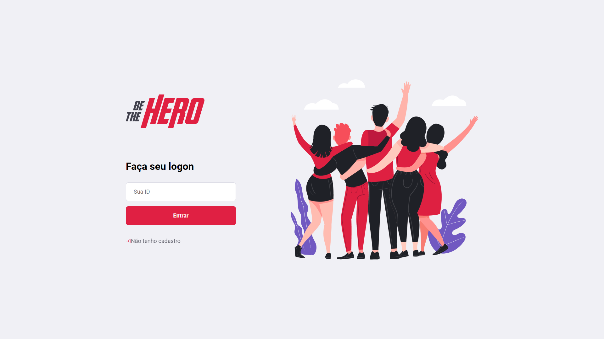
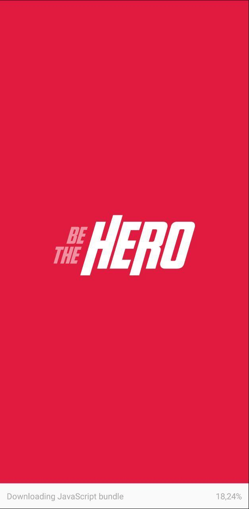
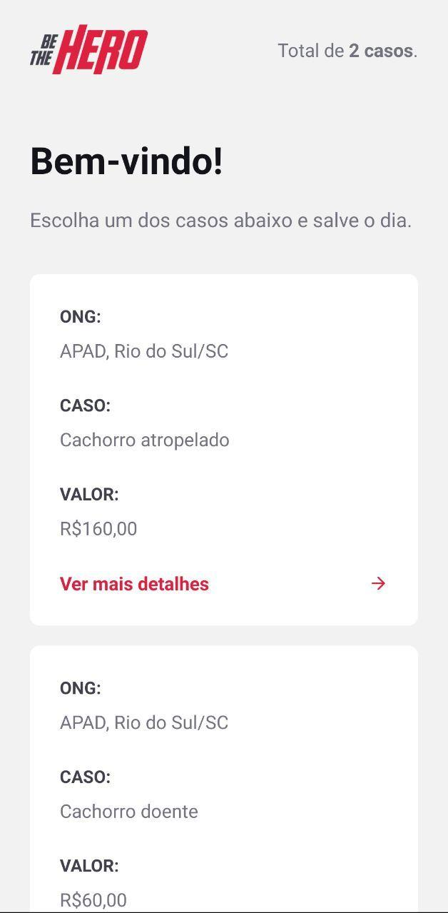
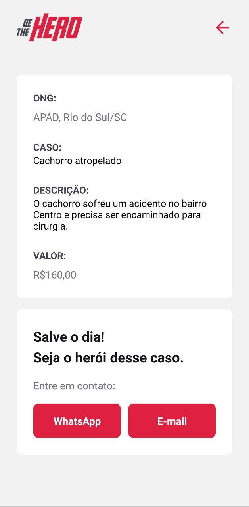

<center>

<h1 align="center">
  
</h1>

<p align="center">
  Projeto <b>Be The Hero</b> desenvolvido durante a Semana Omnistack 11 da Rocketseat
</p>

<p align="center">
  <a aria-label="Versão do Node" href="https://github.com/nodejs/node/blob/master/doc/changelogs/CHANGELOG_V12.md#12.16.1">
    
  </a>
  <a aria-label="Versão do React" href="https://github.com/facebook/react/blob/master/CHANGELOG.md#16131-march-19-2020">
    
  </a>
  <a aria-label="Versão do Expo" href="https://www.npmjs.com/package/expo-cli/v/3.15.5">
    
  </a>
  <a aria-label="Completo" href="https://www.npmjs.com/package/expo-cli/v/3.15.5">
    
  </a>
</p>

</center>

## O projeto
O aplicativo Be The Hero foi criado no conceito de auxiliar ONGs a encontrar financiadores (Heróis) que possam ajudar em uma situação ou problema especificado.

A versão web da aplicação foi feita pensando na ONG. Será por ela que a ONG irá se cadastrar e adicionar os casos em que precisa de financiamento.

<center>



</center>

A versão mobile da aplicação foi pensada para os financiadores(Heróis). Pela aplicação mobile é possível ver casos de todas as ONG's e entrar em contato com a mesma tanto por WhatsApp quanto por E-mail.

<p float="left" align="center">
  
   
  
</p>

## Instalação
Para instalar as dependências e executar o **Servidor** (modo desenvolvimento), clone o projeto em seu computador e em seguida execute:
```bash
cd backend
yarn install
yarn dev
```
No arquivo `frontend/src/services/api.js` altere a baseURL para `'http://localhost:3333'` ou para o endereço do seu servidor para utilizar a api.
Para iniciar o **Frontend** do React utilize os comandos:
```bash
cd frontend
yarn install
yarn start
```
Assim que o processo terminar, automaticamente será aberta no seu navegador a página `localhost:3000` contendo o Projeto desenvolvido no dia 3 de 5.  

Para testar o **Mobile** do React Native, primeiro coloque o endereço do seu servidor (ou computador) no arquivo `src/services/api.js`, e depois execute os comandos:
```bash
# NÃO é preciso executar a linha de baixo caso ja tenha o Expo (CLI) instalado!
yarn global add install expo-cli
cd mobile
yarn install
yarn start
```
Assim que o processo terminar, automaticamente será aberta no seu navegador a página `localhost:19002`. Conecte seu emulador, ou teste o aplicativo por `LAN`: baixe o aplicativo *Expo* da Play Store ou App Store e em seguida escaneie o código QR para utilizar o app.

## Testes
O backend da aplicação possui testes unitários e de integração utilizando a framework de testes [Jest](https://jestjs.io/).

Para execução desses testes execute os sequintes comandos a partir da pasta raiz:
```bash
cd backend
npm test
```

## Imnsonia 
Para testar a API do Be The Hero, baixe e instale o [Insomnia](https://insomnia.rest/download/) e em seguida clique na Workspace → `Import/Export` →  `Import Data` → `From File` → e selecione o arquivo ` 	Insomnia_export.json` deste repositório.

## Licença

[MIT](./LICENSE) &copy; [Rocketseat](https://rocketseat.com.br/)
